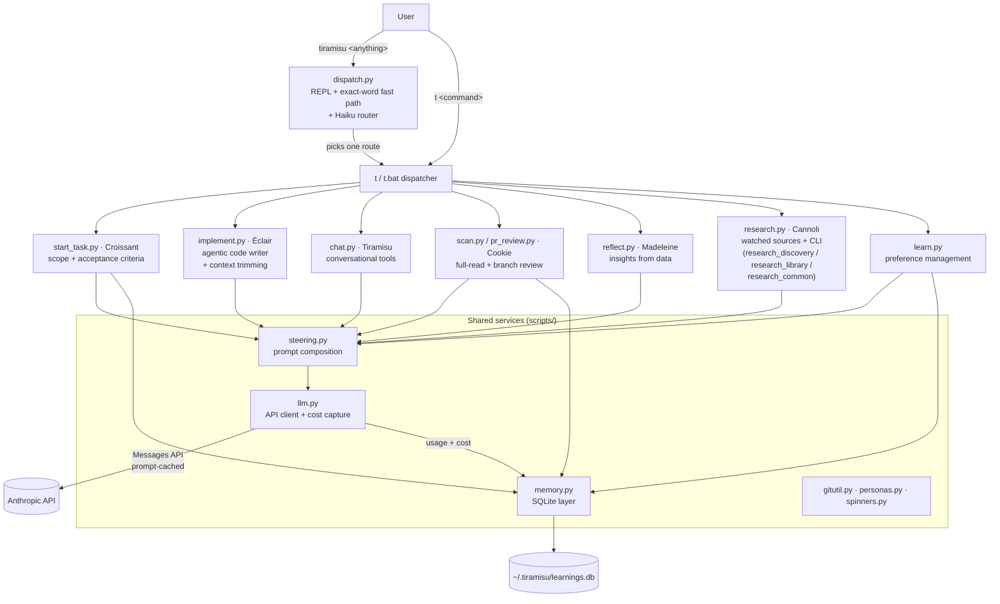
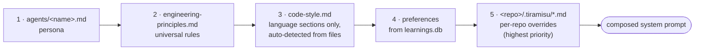
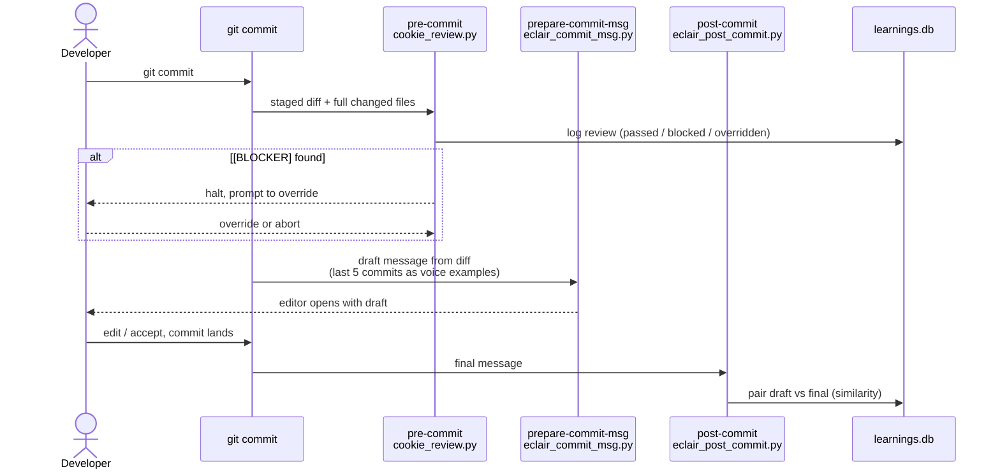
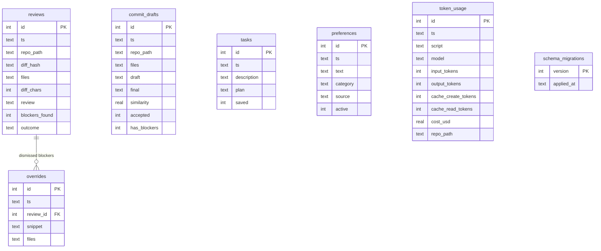
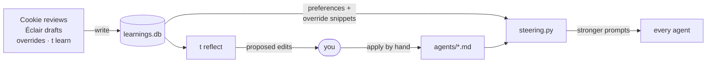
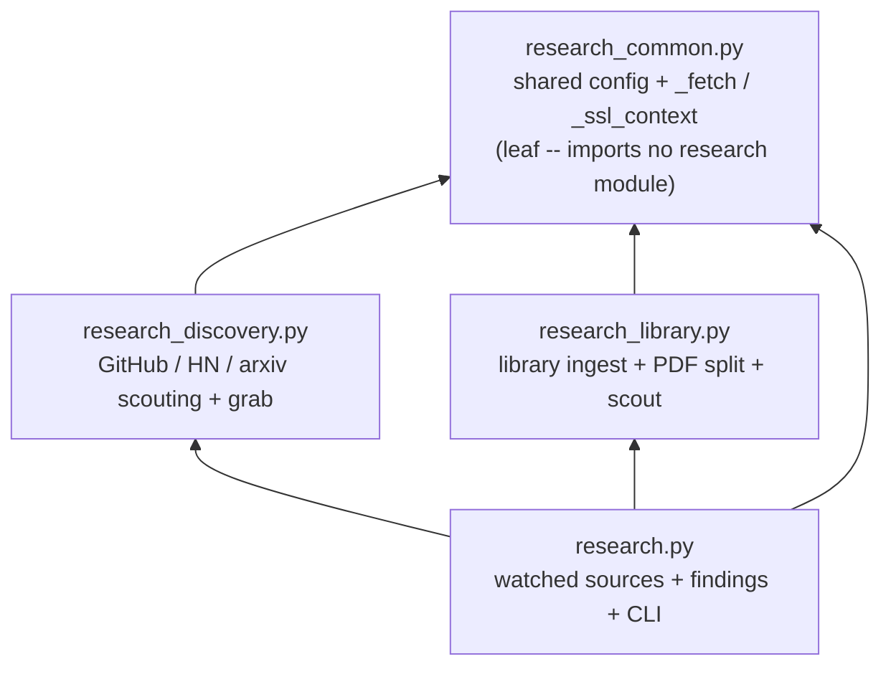

# Tiramisu — Design

Architecture, data model, and workflow diagrams for the Tiramisu multi-agent
CLI. The prose version of this document is [CLAUDE.md](../CLAUDE.md) (project
context for AI agents); the rules the test suite enforces are in
[INVARIANTS.md](INVARIANTS.md). This file is the visual map.

---

## System architecture

One shell entry point routes natural language to a single-purpose agent
script. Every script composes its system prompt from the same steering
layers and logs every API call to the same local database.



---

## Routing pipeline

`tiramisu <anything>` resolves to a `t <command>` in up to three steps —
cheapest first, the LLM only as a last resort:

```mermaid
flowchart TD
    IN["user input"] --> EX{exact command word?<br/>(scan / pr / review / …)}
    EX -->|yes| GO([run t &lt;cmd&gt; -- no API call])
    EX -->|no| LLM["FAST_MODEL router<br/>(one word out, temperature 0)"]
    LLM -->|known route| ARG{cmd == scan and a real<br/>path appears in the input?}
    LLM -->|unknown / API error| FB([fall back to t task])
    ARG -->|yes| GOP([run t scan &lt;path&gt;])
    ARG -->|no| GO2([run t &lt;cmd&gt;])
```

Path forwarding is deliberately conservative: only a token that actually
exists on disk is passed through to `t scan` — natural language never
becomes a CLI argument.

---

## Context management — Éclair's loop

A `t implement` run can take up to 50 tool iterations, each adding tool
results (file reads up to 30K chars). `implement.trim_tool_history` keeps
the conversation under a total budget:

- Over budget → the **oldest** tool-result contents are replaced with a
  short elision note in **one batch**; the most recent
  `KEEP_RECENT_TOOL_ROUNDS` rounds are never touched.
- Only the `content` string is replaced — message structure and
  `tool_use_id` pairing stay intact, so the API's tool rules still hold.
- Batching matters for cost: eliding one round per iteration would move
  the first changed byte forward every call and invalidate the prompt
  cache each time; a batch elision invalidates it once per overflow.
- Éclair can always re-read an elided file — the tools are still there.

Pinned by `tests/test_context_trim.py`.

---

## Steering composition

Every agent's system prompt is assembled by `scripts/steering.py` from fixed
layers, in order. Later layers override earlier ones; nothing is inlined or
duplicated across personas (CLAUDE.md §4.2).



---

## The commit flow

`t hook` installs three git hooks. Git runs them in this order on every
`git commit` (skip once with `--no-verify`):



---

## Data model — `learnings.db`

SQLite, append-mostly, fail-soft (a locked or corrupt DB never blocks the
actual work — CLAUDE.md §4.5). Schema changes ship as append-only
migrations in `scripts/memory.py` (INVARIANTS.md §7).



---

## The learning loop

Data flows in one direction: interactions land in `learnings.db`, and the
steering layer reads them back into future prompts. Agents never rewrite
their own personas — `t reflect` *proposes* edits, the user applies them by
hand (CLAUDE.md §4.3).



---

## Research subsystem layout

Cannoli's subsystem is four modules with a strict, cycle-free import
hierarchy. `research.py` stays the single CLI entry point (`t research …`).



---

## Model tiers

| Tier | Model | Used by | Why |
|---|---|---|---|
| Quality (`DEFAULT_MODEL`) | `claude-sonnet-4-6` | implement, chat, scan, pr, task, reflect, research ingest | Output quality over latency; adaptive thinking enabled on analysis-heavy calls |
| Fast (`FAST_MODEL`) | `claude-haiku-4-5` | router, git hooks, learn classifier, research scans | Hot paths that fire on every commit / keystroke |

Both tiers go through `llm.py`, which marks system prompts cacheable and
logs token usage + estimated cost for every call (CLAUDE.md §4.6).
